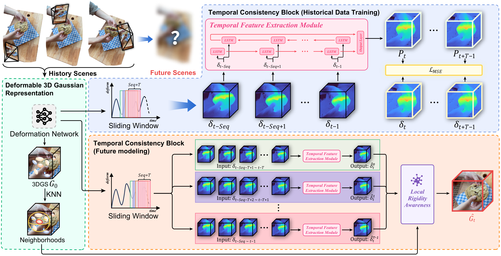

# FutureGS: Structured Gaussian Fields for Future-Aware Dynamic Scene Modeling

[](https://dl.acm.org/doi/abs/10.1145/3746027.3755428)

FutureGS reconstructs a comprehensive dynamic 3D scene from monocular video inputs and predicts future states. Built upon a 3D Gaussian-based representation, it models temporal scene evolution and enables novel view synthesis at future time steps.




## News

- [07/2025]: FutureGS is accepted by ACM MM 2025!

## Preparation

### 1. Clone the repository

```bash
git clone https://github.com/Pioneer6gun9/FutureGS.git --recursive
cd FutureGS
```

### 2. Install dependencies

```bash
pip install -r requirements.txt
pip install submodules/depth-diff-gaussian-rasterization
pip install submodules/simple-knn
```

### 3. Prepare your dataset

In our paper, we use two categories of datasets:

- **Synthetic datasets** from [D-NeRF](https://github.com/alcoholziyang/dnerf): `bouncingballs`, `hellwarrior`, `hook`, `jumpingjacks`, `lego`, `mutant`, `standup`, `trex`

- **Real-world datasets** from [NeRF-DS](https://github.com/activevisionlab/nerfmm) and [Hyper-NeRF](https://github.com/google/hypernerf): including `as`, `basin`, `aleks-teapot`, `espresso`, etc.

We organize the datasets as follows:

```
data/
├── dnerf_predict(9:1)
│   ├── bouncingballs
│   ├── hellwarrior
│   ├── hook
│   └── ...
├── NeRF-DS_predict(9:1)
│   ├── as_novel_view
│   ├── basin_novel_view
│   ├── bell_novel_view
│   └── ...
└── Hyper-NeRF_predict(9:1)
    ├── aleks-teapot
    ├── americano
    ├── broom2
    └── ...
```

**Note:** To adapt to the future prediction task, we split the datasets chronologically: the first 90% of frames are used for training, and the last 10% are reserved for future testing.

### 4. Train the model

```bash
python train.py \
  -s /path/to/dataset \
  -m /path/to/output \
  --eval --is_blender \
  --seq_len 10 \
  --output_frame 1
```

Or use the provided scripts:
```bash
# D-NeRF datasets (synthetic)
./scripts/dnerf.sh bouncingballs 10 1
./scripts/dnerf.sh all 10 1

# NeRF-DS datasets (real-world)
./scripts/nerfds.sh as_novel_view 10 1
./scripts/nerfds.sh all 10 1

# Hyper-NeRF datasets (real-world)
./scripts/hypernerf.sh aleks-teapot 10 1
./scripts/hypernerf.sh all 10 1
```

### 5. Render and evaluate

```bash
# Render predictions
python render.py \
  -s /path/to/dataset \
  -m /path/to/output \
  --eval --is_blender \
  --iteration -1 \
  --seq_len 10 \
  --output_frame 1

# Compute metrics (PSNR/SSIM/LPIPS)
python metrics.py \
  --model_paths /path/to/output
```

## Acknowledgement

This work is built upon:
- [Deformable 3D Gaussians](https://github.com/ingra14m/Deformable-3D-Gaussians)
- [3D Gaussian Splatting](https://github.com/graphdeco-inria/gaussian-splatting)

## Citation

If you find our work helpful, please consider citing:

```bibtex
@inproceedings{ding2025futuregs,
  title={FutureGS: Structured Gaussian Fields for Future-Aware Dynamic Scene Modeling},
  author={Ding, Mingyang and Wang, Zhan and Wang, Jiachen and Han, Tingting and Hu, Xinyuan and Ding, Jiajun and Tan, Min and Kuang, Zhenzhong},
  booktitle={Proceedings of the 33rd ACM International Conference on Multimedia},
  pages={8322--8331},
  year={2025}
}
```
